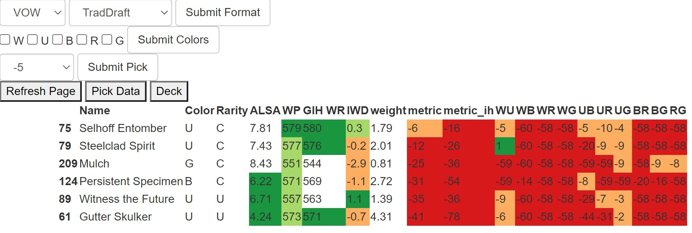

## MTGA-draftapp
Flask app that tracks the MTGA logs and shows the agglomerated 17lands data and data sorted by guilds.

### How to use
- change LOG_PATH in app/configure.py to the path to the MTGA logfile
- run flask app

```
set FLASK_APP=hello
flask run
```

### Features
#### Page: Pick data
- Select set and format and "Submit Format" to load the datatables (if not cached in /data, this will take some time)
- Select primary color(s) to filter color data and "Submit Colors" . If over 2 colors are checked colors defaults to None
- The pick will default to the current (latest in log). To check previous picks, use dropdown and select Submit Pick

:warning: **Due to MTGA logs, the first pick will not be visible. Tracking starts P1P2.**

#### Page: Deck
- An empty deck will default to the whole data table.
- Paste the string from MTGA export to use your pool.
- Select primary color(s) to filter color data and "Submit Colors" . If over 2 colors are checked colors defaults to None


### Example


#### Leged:
- ALSA - Average Last Seen At
- WP - weighted win%
- GIH WP - Game In Hand win%
- IWD - improvement when drawn
- weight - (number of games played)/(number of time picked) 
- metric: a weighted improvement over average decks of same color.
- metric_ih: ditto, but for GIG WP
- Colors data: metric: a weighted improvement over average decks of same color. Never played will have a wp of 0 and default to a large negative number.


